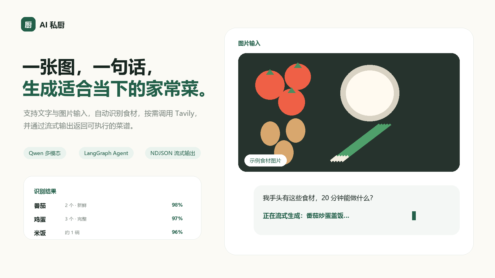
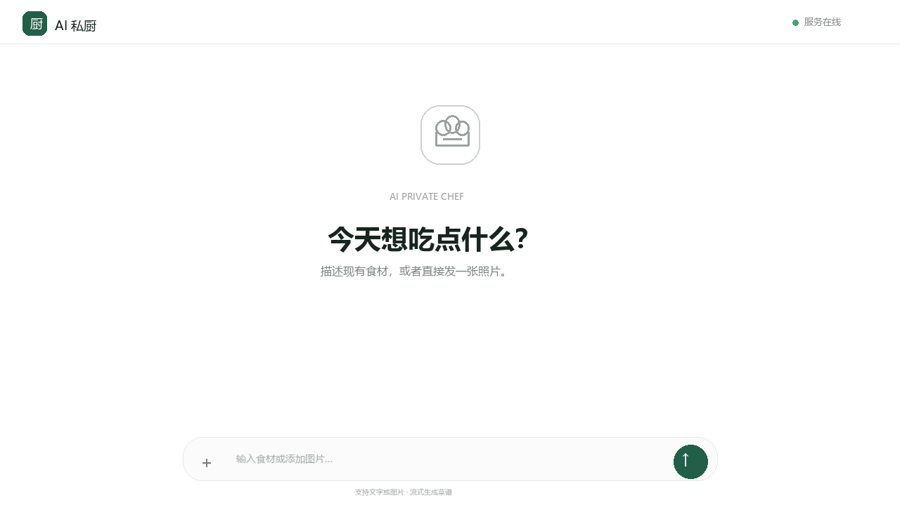
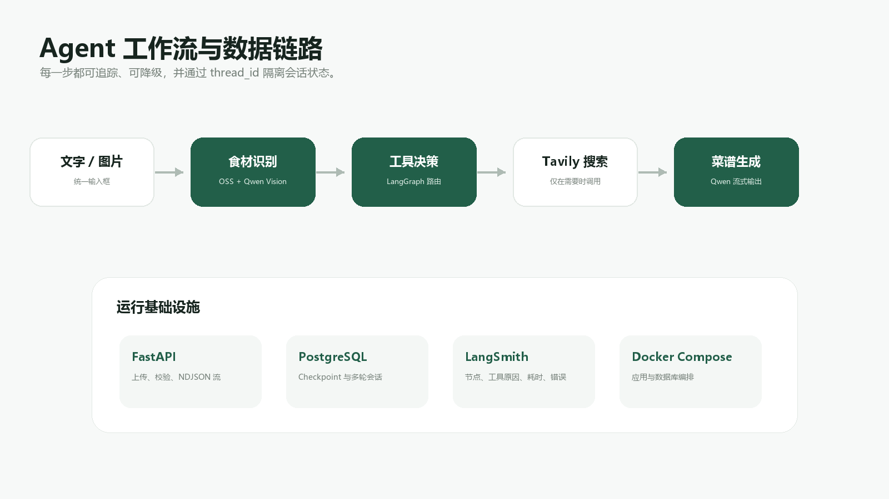
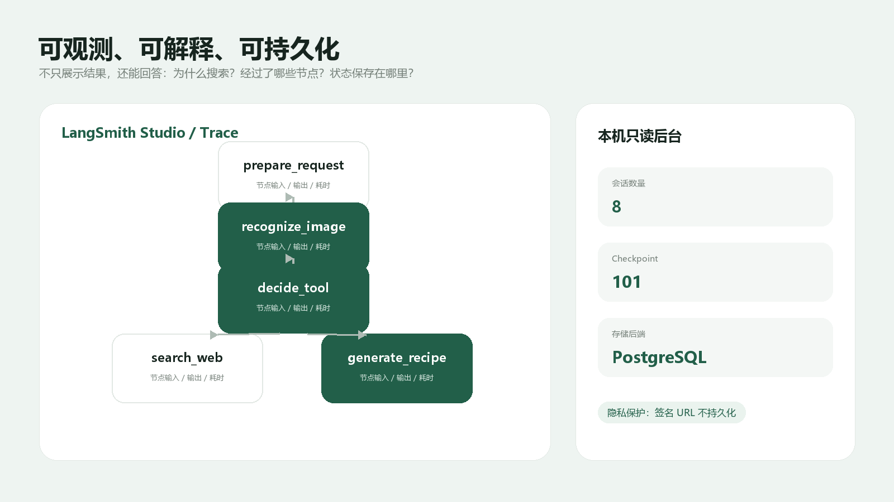

# AI Private Chef · AI 私厨

> 一个支持文字与图片输入、工具决策、流式输出和多轮记忆的多模态菜谱 Agent。




AI 私厨使用 FastAPI 提供统一的文字/图片对话入口，以 LangGraph 编排 Qwen 多模态识别、
工具决策、Tavily 搜索和菜谱生成；开发环境使用 SQLite checkpoint，正式本地部署切换为
PostgreSQL，并通过 LangSmith 查看节点、工具调用原因、耗时和异常。

## 演示视频与交互效果

[](docs/demo/ai-private-chef-demo.webm)

视频使用示例数据，展示图片输入、食材识别、LangGraph 工具决策、流式菜谱输出与运行架构；
不包含真实用户输入、API Key 或生产数据。模型实际输出会随输入变化。

## 项目亮点

| 能力 | 实现 |
| --- | --- |
| 多模态食材识别 | 图片经 OSS 预签名直传，Qwen 输出 Pydantic 结构化食材列表 |
| 智能工具路由 | LangGraph 判断是否需要最新资料或外部来源，仅在必要时调用 Tavily |
| 真正的流式体验 | `/api/chat/stream` 使用 NDJSON 返回进度、工具选择和模型 token |
| 多轮会话记忆 | 使用 `thread_id` 隔离用户状态，SQLite/PostgreSQL checkpoint 持久化 |
| 可观测与解释 | LangSmith 展示节点轨迹、工具调用原因、输入输出、耗时和错误 |
| 本地生产部署 | Docker Compose 编排 FastAPI 与 PostgreSQL，后台仅绑定本机访问 |

## Agent 架构



## 可观测性与会话数据



## 当前进度

当前已经提供：

- 可运行的 FastAPI 项目骨架
- `.env` 环境配置与敏感信息隔离
- 结构化日志和请求 ID
- `/health` 健康检查
- pytest 基础测试
- SQLite/PostgreSQL checkpoint 双后端与连接生命周期管理
- 阿里云 OSS 图片预签名上传及上传后校验
- 浏览器图片拖拽、预览、OSS 直传与进度反馈页面
- Qwen3.7-Plus 多模态食材识别与 Pydantic 结构化输出
- LangGraph 识别工作流与 SQLite checkpoint 会话状态
- 文字或图片食材上下文的结构化菜谱推荐
- LangGraph 工具决策路由，按需调用 Tavily 并返回可验证来源
- 菜谱对话的 SQLite checkpoint 持久化
- LangSmith tracing 与隐私保护配置
- Docker Compose 本地生产部署（FastAPI + PostgreSQL）

开发模式默认使用 SQLite；正式本地部署使用 PostgreSQL。

## 项目结构

```text
AI私厨/
├─ backend/
│  ├─ app/
│  │  ├─ agent/       # LangGraph、Qwen 与 Tavily 工作流
│  │  ├─ api/         # FastAPI 接口
│  │  ├─ core/        # 配置、日志与 checkpoint
│  │  ├─ schemas/     # 请求和响应数据模型
│  │  └─ services/    # OSS、后台等业务服务
│  └─ tests/          # 自动化测试
├─ frontend/
│  ├─ index.html      # 用户对话页面
│  ├─ admin.html      # 本机只读后台
│  └─ assets/         # 当前页面使用的 CSS 与 JavaScript
├─ scripts/           # Studio 和本地运行脚本
├─ data/              # SQLite 本地数据（不提交到 Git）
├─ Dockerfile
├─ compose.yaml       # FastAPI + PostgreSQL 本地生产部署
├─ langgraph.json     # LangSmith Studio 图配置
├─ pyproject.toml     # Python 依赖与工具配置
└─ README.md
```

根目录中的隐藏项也有明确用途：`.git` 保存版本历史，`.idea` 保存 PyCharm 项目设置，
`.langgraph_api` 与 `.studio-runtime` 是 LangGraph Studio 的本地状态和隔离运行环境。
`.env`、`.env.production` 保存本机配置和密钥，均不会提交到 Git，不应随意删除。

## 本地启动（Windows PowerShell）

```powershell
python -m venv .venv
.\.venv\Scripts\Activate.ps1
python -m pip install --upgrade pip
python -m pip install -e ".[dev,agent,sqlite,oss]"
Copy-Item .env.example .env
python -m uvicorn backend.app.main:app --reload
```

访问：

- 前端页面：<http://127.0.0.1:8000/>
- 服务信息：<http://127.0.0.1:8000/api/info>
- 健康检查：<http://127.0.0.1:8000/health>
- API 文档：<http://127.0.0.1:8000/docs>
- 本机只读后台：<http://127.0.0.1:8000/admin>

## 测试与静态检查

```powershell
python -m pytest
python -m ruff check .
```

## 配置原则

- 不在源代码中保存 API Key。
- `.env` 仅用于本地开发且不会提交到 Git。
- 默认使用 `sqlite+aiosqlite:///./data/ai_private_chef.db`。
- PostgreSQL 部署时只需更换 `DATABASE_URL` 并设置
  `CHECKPOINTER_BACKEND=postgres`。

## OSS 图片上传流程

1. 前端调用 `POST /api/uploads/presign`，传入文件名、MIME 类型和字节数。
2. 前端严格使用响应中的 `method`、`upload_url` 和 `headers` 将文件直传 OSS。
3. 上传完成后调用 `POST /api/uploads/complete`，后端从 OSS 核对实际类型和大小。
4. Agent 处理图片前，通过服务层生成短期 GET URL；该 URL 不持久化。
5. 对话页调用 `POST /api/chat/stream`，服务以 NDJSON 流依次返回识别进度、
   工具选择、Qwen 实时 token 和完成事件，并用 `thread_id` 持久化完整回答。
6. `/api/recognitions` 与 `/api/recipes/recommend` 仍作为独立接口保留，便于调试和集成。

当前允许 JPEG、PNG 和 WEBP，默认最大 10 MB。OSS Bucket 必须配置 CORS，开发环境
至少允许 `http://127.0.0.1:8000` 和 `http://localhost:8000` 发起 `PUT`、`GET`、
`HEAD` 请求，并允许 `Content-Type` 请求头。

## Qwen 与 LangSmith

在 `.env` 中配置 `DASHSCOPE_API_KEY` 后，前端上传完成会通过阿里云百炼的
OpenAI 兼容接口调用视觉模型。默认模型为 `qwen3.7-plus`，北京地域默认
`DASHSCOPE_BASE_URL=https://dashscope.aliyuncs.com/compatible-mode/v1`。API Key 必须与
Base URL 所在地域一致。开发环境的 checkpoint 保存到
`./data/checkpoints.sqlite`，其中只保存 OSS `object_key` 和结构化识别结果，不保存会过期
的签名 URL。

需要启用 LangSmith 时填写 `LANGSMITH_API_KEY`，并设置：

```env
LANGSMITH_TRACING=true
LANGSMITH_PROJECT=ai-private-chef-dev
```

默认同时启用 `LANGSMITH_HIDE_INPUTS` 与 `LANGSMITH_HIDE_OUTPUTS`，避免用户输入和 OSS
签名 URL 进入追踪数据。节点名称、调用关系、耗时和错误状态仍会记录。

## LangSmith Studio 本地调试

Studio 使用根目录的 `langgraph.json` 加载菜谱 Agent，支持 Chat 多轮会话和单张
图片附件。图片会先经过 `prepare_request -> recognize_image` 上传至 OSS，再由 Qwen
通过短期签名 URL 识别食材；随后进入
`decide_tool -> search_web（按需）-> generate_recipe`。Studio 可以直观查看食材
识别结果、Tavily 调用原因、搜索结果以及最终菜谱。

首先确保 `.env` 已配置 Qwen、Tavily 和 LangSmith Key，并在调试期间允许追踪
输入输出：

```env
LANGSMITH_TRACING=true
LANGSMITH_HIDE_INPUTS=false
LANGSMITH_HIDE_OUTPUTS=false
```

启动 Studio 本地 Agent Server：

```powershell
python -m venv .venv-studio
.\.venv-studio\Scripts\Activate.ps1
python -m pip install "pydantic-settings>=2.7,<3.0" `
  "langchain>=1.0,<2.0" "langchain-openai>=1.0,<2.0" `
  "langchain-tavily>=0.2,<1.0" "langgraph>=1.2,<1.3" `
  "langgraph-cli[inmem]>=0.4,<1.0"
langgraph dev --port 2024 --allow-blocking
```

Studio CLI 与当前 FastAPI 的 Starlette 版本约束不兼容，因此使用独立的
`.venv-studio` 环境，不要将 `langgraph-cli[inmem]` 安装进应用的开发或生产环境。
Windows 中若出现 GBK 解码错误，启动前设置 `$env:PYTHONUTF8="1"`。当前已
配置好的本机环境也可直接执行 `./scripts/start_studio.ps1`。

Studio 中可用以下输入观察一次必须搜索的路由：

```json
{
  "user_message": "请搜索一份带来源的最新番茄炒蛋做法",
  "ingredients": [
    {"name": "番茄", "quantity": "2个", "state": "新鲜"},
    {"name": "鸡蛋", "quantity": "3个", "state": "新鲜"}
  ],
  "image_context": null,
  "messages": [
    {"role": "user", "content": "请搜索一份带来源的最新番茄炒蛋做法"}
  ],
  "search_results": []
}
```

Studio 使用独立的本地调试状态，不会写入 FastAPI 生产容器中的 PostgreSQL
checkpoint。调试数据会上传到 LangSmith，请勿在 Studio 中输入真实隐私数据。
Studio 当前每条消息最多接收一张 JPG、PNG 或 WebP 图片，大小限制与
`OSS_MAX_IMAGE_SIZE_BYTES` 一致；图片位于哪个本地磁盘不影响识别。

## 正式本地部署（PostgreSQL）

需要先安装 Docker Desktop，然后执行：

```powershell
python -m scripts.prepare_production_env
# 脚本从现有 .env 迁移外部服务配置，并生成随机 PostgreSQL 密码
docker compose --env-file .env.production up --build -d
docker compose --env-file .env.production ps
Invoke-RestMethod http://127.0.0.1:8000/health
```

应用容器会在 PostgreSQL 健康后启动，并自动执行 LangGraph checkpoint 的幂等数据库
迁移。会话数据保存在 `postgres_data` 卷中，重启容器后仍然存在。停止服务使用
`docker compose --env-file .env.production down`；不要添加 `-v`，否则会同时删除
PostgreSQL 数据卷。

后台管理页面和容器端口均仅绑定到 `127.0.0.1`，用于只读查看运行摘要、会话列表及
最新 checkpoint 状态，不提供删除或修改接口。
